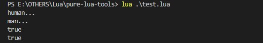
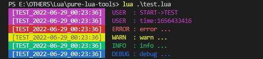

### Pure Lua Tools

0. About

> there are some useful tools for lua, u can require `tools.lua` file and enjoy the tools ...

```lua
require('./tools')
-- do something with tools
```

1. class

```lua
local Animal = class("Animal")
function Animal:__init__()
    print('animal init ...')
end
function Animal:eat(something)
    print(string.format('eating a poor %s ...', something))
end

local Dog, Parent = class("Dog", Animal)
function Dog:__init__()
    Parent:__init__(self)
    print('dog init ...')
end
function Dog:eat(something)
    Parent.eat(self, something)
end

local dog = Dog()
print(dog)
dog:eat('cat')

-- animal init ...
-- dog init ...
-- <object Dog>: 01085670
-- eating a poor cat ...
```

2. events

```lua
events = Events()
events:addListener('testEvent', function(argument)
    print('callback1 receive: ' .. argument)
end, 1) -- once
events:addListener('testEvent', function(argument)
    print('callback2 receive: ' .. argument)
end, 3) -- limeted
events:addListener('testEvent', function(argument)
    print('callback3 receive: ' .. argument)
end, 0) -- forever
events:triggerEvent('testEvent', 1)
events:triggerEvent('testEvent', 2)
events:triggerEvent('testEvent', 3)
events:triggerEvent('testEvent', 4)
events:triggerEvent('testEvent', 5)

-- callback1 receive: 1
-- callback2 receive: 1
-- callback3 receive: 1
-- callback2 receive: 2
-- callback3 receive: 2
-- callback2 receive: 3
-- callback3 receive: 3
-- callback3 receive: 4
-- callback3 receive: 5
```

3. files

```lua
-- write, read
local fileName = "some/file/nam.txt"
files.write(fileName, 'content...')
files.is_file(fileName)
local content = files.read(fileName)
files.delete(fileName)
-- list dir
local dirName = 'some/folder/name/'
files.is_folder(dirName)
local fileNames = files.list(dirName)
-- size
files.size(fileName)
-- watch
files.watch({'test1.txt', 'test1.txt'}, function(path, newTime)
    print(path, os.date("modified at: %Y-%m-%d %H:%M:%S", newTime))
end)
```

4. json

```lua
-- json.null stands for lua nil
local test = {
    [1] = 'numberKey',
    boolenValue = true,
    nullValue = json.null,
    objectValue = {
        stringValue = "json is ready!",
    },
    arrayValue = {"enjoy", "it", "!"},
}

-- encode
local s = json.encode(test)
print(s)
-- {"1":"numberKey","objectValue":{"stringValue":"json is ready!"},"nullValue":null,"arrayValue":["enjoy","it","!"],"boolenValue":true}

-- decode
local t = json.decode(s)
print(t)
-- table: 010A3D40
```

5. table

```lua
-- test table value with some feature
local value = table.new({
    key = "value",
})

-- encode, decode
local s = value:encode() -- lua script string of the table value
local t = s:decode() -- table value of the script string

-- write, read
value:write_to_file('test.txt')
local t = table.read_from_file('test.txt')

-- keys, values
local keys = value:keys()
local values = value:values()

-- merge
local t = value:merge({newKey= "newValue"})
```

6. timer

```lua
-- sync
timer.async(function()
    timer.sleep(1)
    print('one')
    timer.sleep(1)
    print('two')
    timer.sleep(1)
    print('three')
end)

-- delay
timer.delay(2, function()
    print('delay')
end)

-- start the loop
print("start")
print("end!")
timer.start()

-- start
-- one
-- delay
-- two
-- three
-- end!
```

7. string

```lua
-- test string value with some feature
local s = string.new('abcd')

-- fill
local r = s:center(6, ' ') -- ' abcd '
local r = s:left(6, ' ') -- 'abcd  '
local r = s:right(6, ' ') -- '  abcd'

-- trim
local s = s:trim() -- 'abcd'

-- execute
s:execute()
```

8. bit

```lua
r = bit.rshift(2, 1) -- 1
r = bit.lshift(2, 1) -- 4
r = bit.band(1, 3) -- 1
r = bit.bor(1, 2) -- 3
r = bit.bxor(1, 3) -- 2
r = bit.bnot(1) -- -2
```

9. encryption
```lua
encryption.md5('hello') -- 5d41402abc4b2a76b9719d911017c592
```

10. http

```lua
-- download
http.download('http://example.xyz/some/file.txt', './file.txt')

-- request
local isOk, code, content = http.get('http://example.xyz/some/url', {queryKey = "value"}, {headerKey = "value"})
local isOk, code, content = http.post('http://example.xyz/some/url', {bodyKey = "value"}, {headerKey = "value"})
assert(isOk and code == 200)
print(content)
```

11. Object

```lua
-- new class
local Human = Object:ext()
function Human:init()
    print('human...')
end
-- extended class
local Man = Human:ext()
function Man:init()
    Human.init(self)
    print('man...')
end
-- a object
local alex = Man:new()
print(alex:is(Man))
print(alex:is(Human))
```



12. Log

```lua
local log = Log('log.txt', 'TEST', Log.LEVEL.USER, Log.COLOR.TAG_BG_CONTENT_FG)
log:user('time:%d', os.time())
log:error('error ...')
log:warn('warn ...')
log:info('info ...')
log:debug('debug ...')
```



13. package

```lua
-- other.lua
a = 10
b = {}
b.c = 'c...'
print(b)
return b

-- test.lua
local path = './other.lua'
local m = package.doload(path)
print(m)
print(package.isloaded(path))
print(a)
print(m.c)

-- table: 02246FB8
-- table: 02246FB8
-- true
-- 10
-- c...
```

---

> for more feture plz read the source code ...
