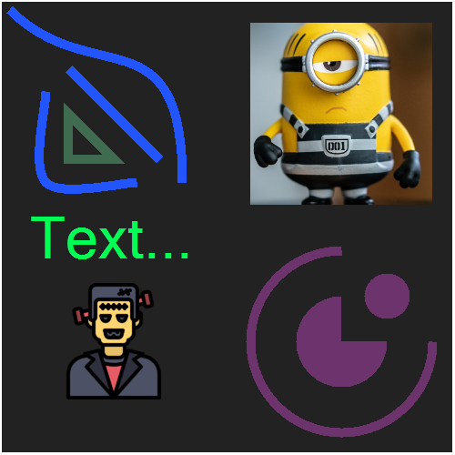
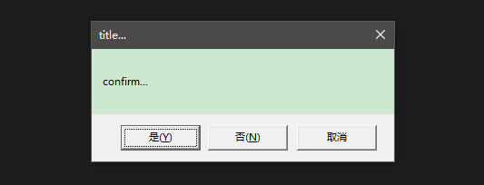
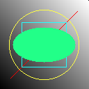

### Pure Lua Tools

0. About

> there are some useful tools for lua, u can require `tools.lua` file and enjoy the tools ...

```lua
require('./tools')
-- do something with tools
```

1. class

```lua
local Animal = class("Animal")
function Animal:__init__()
    print('animal init ...')
end
function Animal:eat(something)
    print(string.format('eating a poor %s ...', something))
end

local Dog, Parent = class("Dog", Animal)
function Dog:__init__()
    Parent:__init__(self)
    print('dog init ...')
end
function Dog:eat(something)
    Parent.eat(self, something)
end

local dog = Dog()
print(dog)
dog:eat('cat')

-- animal init ...
-- dog init ...
-- <object Dog>: 01085670
-- eating a poor cat ...
```

2. events

```lua
events = Events()
events:addListener('testEvent', function(argument)
    print('callback1 receive: ' .. argument)
end, 1) -- once
events:addListener('testEvent', function(argument)
    print('callback2 receive: ' .. argument)
end, 3) -- limeted
events:addListener('testEvent', function(argument)
    print('callback3 receive: ' .. argument)
end, 0) -- forever
events:triggerEvent('testEvent', 1)
events:triggerEvent('testEvent', 2)
events:triggerEvent('testEvent', 3)
events:triggerEvent('testEvent', 4)
events:triggerEvent('testEvent', 5)

-- callback1 receive: 1
-- callback2 receive: 1
-- callback3 receive: 1
-- callback2 receive: 2
-- callback3 receive: 2
-- callback2 receive: 3
-- callback3 receive: 3
-- callback3 receive: 4
-- callback3 receive: 5
```

3. files

```lua
-- write, read
local fileName = "some/file/nam.txt"
files.write(fileName, 'content...')
files.is_file(fileName)
local content = files.read(fileName)
files.delete(fileName)
-- list dir
local dirName = 'some/folder/name/'
files.is_folder(dirName)
local fileNames = files.list(dirName)
-- size
files.size(fileName)
-- watch
files.watch({'test1.txt', 'test1.txt'}, function(path, newTime)
    print(path, os.date("modified at: %Y-%m-%d %H:%M:%S", newTime))
end)
```

4. json

```lua
local test = {
    [1] = 'numberKey',
    boolenValue = true,
    nullValue = null,
    objectValue = {
        stringValue = "json is ready!",
    },
    arrayValue = {"enjoy", "it", "!"},
}

-- encode
local s = json.encode(test)
print(s)
-- {"1":"numberKey","objectValue":{"stringValue":"json is ready!"},"nullValue":null,"arrayValue":["enjoy","it","!"],"boolenValue":true}

-- decode
local t = json.decode(s)
print(t)
-- table: 010A3D40
```

5. table

```lua
-- test table value with some feature
local value = table.new({
    key = "value",
})

-- encode, decode
local s = value:encode() -- lua script string of the table value
local t = s:decode() -- table value of the script string

-- write, read
value:write_to_file('test.txt')
local t = table.read_from_file('test.txt')

-- keys, values
local keys = value:keys()
local values = value:values()

-- merge
local t = value:merge({newKey= "newValue"})
```

6. timer

```lua
-- sync
timer.async(function()
    timer.sleep(1)
    print('one')
    timer.sleep(1)
    print('two')
    timer.sleep(1)
    print('three')
end)

-- delay
timer.delay(2, function()
    print('delay')
end)

-- start the loop
print("start")
print("end!")
timer.start()

-- start
-- one
-- delay
-- two
-- three
-- end!
```

7. string

```lua
-- test string value with some feature
local s = string.new('abcd')

-- fill
local r = s:center(6, ' ') -- ' abcd '
local r = s:left(6, ' ') -- 'abcd  '
local r = s:right(6, ' ') -- '  abcd'

-- trim
local s = s:trim() -- 'abcd'

-- execute
s:execute()
```

8. bit

```lua
r = bit.rshift(2, 1) -- 1
r = bit.lshift(2, 1) -- 4
r = bit.band(1, 3) -- 1
r = bit.bor(1, 2) -- 3
r = bit.bxor(1, 3) -- 2
r = bit.bnot(1) -- -2
```

9. encryption
```lua
encryption.md5('hello') -- 5d41402abc4b2a76b9719d911017c592
```

10. http

```lua
-- download
http.download('http://example.xyz/some/file.txt', './file.txt')

-- request
local isOk, code, content = http.get('http://example.xyz/some/url', {queryKey = "value"}, {headerKey = "value"})
local isOk, code, content = http.post('http://example.xyz/some/url', {bodyKey = "value"}, {headerKey = "value"})
assert(isOk and code == 200)
print(content)
```

11. Object

```lua
-- new class
local Human = Object:ext()
function Human:init()
    print('human...')
end
-- extended class
local Man = Human:ext()
function Man:init()
    Human.init(self)
    print('man...')
end
-- a object
local alex = Man:new()
print(alex:is(Man))
print(alex:is(Human))
```


12. Log

```lua
local log = Log('log.txt', 'TEST', Log.LEVEL.USER, Log.COLOR.TAG_BG_CONTENT_FG)
log:user('time:%d', os.time())
log:error('error ...')
log:warn('warn ...')
log:info('info ...')
log:debug('debug ...')
```


13. package

```lua
-- other.lua
a = 10
b = {}
b.c = 'c...'
print(b)
return b

-- test.lua
local path = './other.lua'
local m = package.doload(path)
print(m)
print(package.isloaded(path))
print(a)
print(m.c)

-- table: 02246FB8
-- table: 02246FB8
-- true
-- 10
-- c...
```

14. Graphic

```lua
local graphic = Graphic()
-- stage
graphic:setXY(250, 250):setWH(495, 495):setClip()
graphic:setXY(250, 250):setWH(500, 500):setColor("#222222"):addRectangle()
-- text
graphic:setXY(125, 265):setColor("#00ff55"):addText("Text...", 48, nil)
-- iamges
graphic:setXY(375, 125):setWH(200, 200):addImage("./others/yellow.png", 75, 75, 350, 350)
graphic:setXY(125, 375):setWH(128, 128):addImage("./others/test.png", 0, 0, 128, 128)
-- lines
graphic:setColor("#2255ff")
graphic:addLine({75, 75}, {175, 175})
graphic:addCurve({50, 100}, {50, 200}, {150, 200})
graphic:addBezier({10, 10}, {100, 100}, {200, 10}, {200, 200})
-- shapes
graphic:setColor("#55ff55ff")
graphic:setXY(425, 325):setWH(50, 50):addEllipse()
graphic:setXY(375, 375):setWH(100, 100):addPie()
graphic:setXY(375, 375):setWH(200, 200):addArc()
graphic:setColor("#5577ffaa")
graphic:addPolygon({75, 125}, {75, 175}, {125, 175})
-- show or save
graphic:show()
-- graphic:save("./others/graphic.png")
```



15. Dialog

```lua
local r = dialog.show_confirm("title...", "confirm...", YesNoCancel)
print("result:", r)
-- result: true
```



16. Path

```lua
local path = Path()
-- 
print(path:set("~"):get())
-- C:\Users\user
print(path:push("../xyz/abc"):get())
-- C:\Users\xyz\abc
print(path:relative(Path("~")):get())
-- ..\..\user
print(Path("~"):relative(path):get())
-- ..\xyz\abc
```

17. Time

```lua
local time = Time(os.time())
print(time:getYear())
-- 2022
local time = Time(60 * 60 * 24 * 10 + 60 * 60 * 5 + 60 * 7 + 9)
print(time:countDay())
-- 1 3 5 7 9
```

18. library

```lua
-- write png
local img = library.pngEncode(4, 4, "rgba")
while not img.done do
    img:write({150, 100, 50, 200})
end
files.write("./test.png", table.concat(img.output), "wb")
-- read png
local data = files.read("./test.png", "rb")
local img = library.pngDecode(data, printProg)
local pixel = img:getPixel(2, 2)
print("size:", img.width, img.height, "depth:", img.depth, "color:", img.colorType)
print("pixel:", pixel.R, pixel.G, pixel.B, pixel.A)
```

18. Canvas

```lua
-- draw canvas
local size = 128
local canvas = Canvas(size, size)
for i=1,size do
    for j=1,size do
        local c = (i + j - 1) % 255
        canvas:setPixel(i, j, colors.rgb_to_hex({c, c, c}))
    end
end
local c = math.round(size / 2)
local d = math.round(c * 0.25)
canvas:drawLine(c + d * 3, c + d * 3, c - d * 3, c - d * 3, 0xff0000)
canvas:drawRect(c - d * 2, c + d * 2, c + d * 2, c - d * 2, false, 0x22ffff)
canvas:drawCircle(c, c, c - d, false, 0xffff44)
canvas:drawEllipse(c, c, c - d * 2, c - d * 3, 0x22ff88)
-- write to file
local img = library.pngEncode(size, size, "rgba")
for y=size,1,-1 do
    for x=1,size do
        local px = canvas:getPixel(x, y)
        local rgba = table.insert(colors.hex_to_rgb(px), 255)
        assert(#rgba == 4)
        img:write(rgba)
    end
end
assert(img.done == true)
files.write("./others/test_canvas.png", table.concat(img.output), "wb")
```



19. colors

```lua
local rand = colors.get_random_rgb()
local grey = colors.rgb_get_grayscale(rand)
local hex = colors.rgb_to_hex(grey)
```

20. bmp

```lua
local size = 128
local pixels = {}
for y=size,1,-1 do
    pixels[y] = {}
    for x=1,size do
        local r = math.floor((x / size * 255)) % 256
        local g = math.floor((y / size * 255)) % 256
        local b = math.floor(((x + y) / size * 255)) % 256
        pixels[y][x] = {r, g, b}
    end
end
local path = "./others/test_bmp.bmp"
bmp.write(path, size, size, pixels)
local w, h, pxs = bmp.read(path)
assert(w == size and h == size)
```


21. Point

```lua
local p = Point(10, 10):rotate(-90)
print(p.x, p.y)
-- 10 -10
```

22. yaml

```lua
local text = [[
time: 2023-09-12_21:30:00+08
one:&anchor1
  a:'aaa'
  b:"bbb" # comment2...
two:
  c:ccc # comment3...
  <<:*anchor1
  d:0xff
three:
  - &anchor2 xxx
  - yyy
  # comment1...
  - zzz
  - *anchor2
]]
local data = yaml.decode(text)
print(data)
-- {
--   [time] = 1694496600,
--   [one] = {
--     [a] = "aaa",
--     [b] = "bbb"
--   },
--   [two] = {
--     [c] = "ccc",
--     [a] = "aaa",
--     [d] = 255,
--     [b] = "bbb"
--   }
--   [three] = {
--     (1) = "xxx",
--     (2) = "yyy",
--     (3) = "zzz",
--     (4) = "xxx"
--   },
-- }
```

22. plist

```lua
local text = [[
<?xml version="1.0" encoding="UTF-8"?>
<!DOCTYPE plist PUBLIC "-//Apple//DTD PLIST 1.0//EN" "http://www.apple.com/DTDs/PropertyList-1.0.dtd">
<plist version="1.0">
<dict>
    <key>a</key>
    <array>
        <real>1</real>
        <real>2</real>
    </array>
    <key>s</key>
    <string>str...</string>
    <key>b</key>
    <true/>
</dict>
</plist> 
]]
local t = plist.decode(text)
print(t)
-- {
--   [a] = {
--     (1) = 1,
--     (2) = 2
--   },
--   [s] = "str...",
--   [b] = true
-- }
```

---

> for more feture plz read the source code ...
